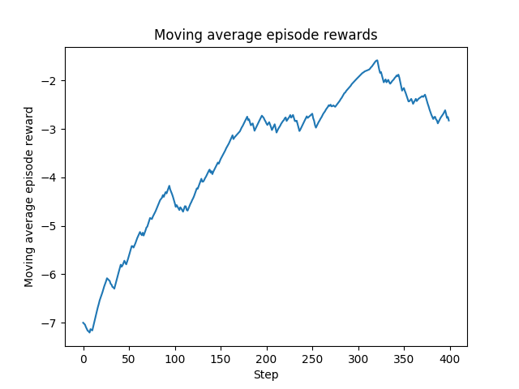
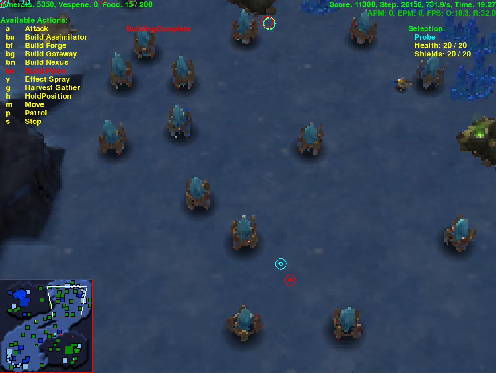
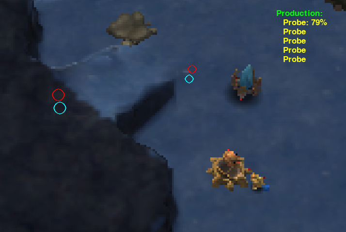

# ProbiusZero

<!-- This project melds the DeepMind [PySC2 StarCraft II learning environment](https://github.com/deepmind/pysc2), DeepMind's [Asynchronous Advantage Actor-Critic (A3C) algorithm](https://arxiv.org/abs/1602.01783), OpenAI [Gym](https://gym.openai.com/), and the best strategy in StarCraft II &mdash; the [cannon rush](https://liquipedia.net/starcraft2/Photon_Cannon_Rush).


## Overview

StarCraft II is a rich environment for reinforcement learning. The game offers [large action and state spaces, imperfect information, and delayed credit assignment](https://arxiv.org/abs/1708.04782), all challenges which generalize to a wide class of problems. I focus on one StarCraft II strategy requiring a subset of StarCraft II's full action space, the Protoss cannon rush.

I train an agent limited to building units and structures in a standard photon cannon rush build order. The agent learns by employing a discrete A3C algorithm playing against a similar agent performing random actions. This implementation makes the following public contributions to previous work:

1. The first OpenAI Gym environment compatible with PySC2 v3.0.

2. The first application of A3C to raw actions and observations on a subset of the full StarCraft II game. Existing public A3C implementations with PySC2 largely focus on minigames (MoveToBeacon, CollectMineralShards, etc.).

Project structure and brief functionality follows. `cannon_rusher.py` specifies training hyperparameters, and calls the `a3c` package to create the network and workers. Each worker creates two agents for each epsisode in the `cheese_gym` environment to play the game. Replays and plots after training are stored in the `results` directory.

```
.
├── a3c/
│   ├── __init__.py
│   ├── a3c.py               # Network and worker class for A3C.
│   ├── shared_adam.py       # Shared Adam optimizer for workers.
│   └── utils.py             # A3C utilities.
├── cheese-gym/
│   ├── cheese_gym/
│   │   ├── envs/
│   │   │   ├── __init__.py
│   │   │   └── sc2_game.py  # OpenAI Gym environment for PySC2.
│   │   └── __init__.py
│   └── setup.py
├── play/                    # Replays and reward plot.
│   ├── game_0.SC2Replay
│   ├── game_1.SC2Replay
│   └── reward.png
├── LICENSE
├── README.md
└── cannon_rusher.py         # Master function for training.
```

#### Dependencies

* PySC2 v3.0
* PyTorch v1.2
* Gym v0.14.0
* numpy
* matplotlib

## Custom PySC2 Gym environment

I learned basic PySC2 usage and adapted many functions from [Steven Brown's PySC2 tutorials](https://github.com/skjb/pysc2-tutorial)

Agents are limited to a few general actions.

* Do nothing (no_op).
* Build a probe.
* Send an idle probe back to mining.
* Build a Pylon in a sector of the map.
* Build a Forge in a sector of the map.
* Build a Photon Cannon in a sector of the map.

The map (Simple64) has dimension 64. I subdivide the map into sectors. When a build action is issued, the environment generates a random x and y position within the map sector. The action space includes a build action for every structure in every map sector.

I increase the step multiplier to 64 to speed up training. Each step, I transform the PySC2 observation returned from the PySC2Env step function into a state to return to each worker network. This smaller state space specifies:

* Allied Nexus spawn location.
* Allied Nexus alive.
* Enemy Nexus alive.
* Allied Probe count.
* Allied Pylon count.
* Allied Forge count.
* Allied Photon Cannon count.
* Enemy Probe count.
* Enemy Pylon count.
* Enemy Forge count.
* Enemy Photon Cannon count.

Each step, the reward is defined as the change in the resources lost balance between the two agents. A positive reward is returned if the resources lost balance changed in favor of the smart agent in the last step (that is, the agent destroyed more value in units and structures than it lost in the last step). While this reward definition may not lead to higher winrates when compared to a sparse reward of +1 win, -1 loss, it allows for faster initial training.

Install the environment by running `pip install -e .` from within the `cheese-gym` directory.

## A3C

I adapted [Morvan Zhou's excellent simple discrete A3C implementation](https://github.com/MorvanZhou/pytorch-A3C) for PySC2.

The main function creates a global network and starts as many workers as there are CPUs. Each worker uses a simple network of four linear feedforward layers. This training used user-tunable values of

* `GAMMA = .1  # Discount factor.`
* `LEARNING_RATE = .001`

Each worker creates its own PySC2Env, and recommends an action to the smart agent based on its local network. It chooses a random action for the second agent. Every user defined `UPDATE_GLOBAL_ITER`, all workers update the global network parameters.

Arthur Juliani's more detailed explanation of A3C can be found [here](https://medium.com/emergent-future/simple-reinforcement-learning-with-tensorflow-part-8-asynchronous-actor-critic-agents-a3c-c88f72a5e9f2).

## Play

With minimal training, the smart agent is able to improve its resources lost balance over the game compared to a random agent. However, it is easy for the agent to get stuck repeating the same action over and over. I chose a low discount factor to prevent initial invalid actions (such as building a Forge before building a Pylon) from dominating.

Moving average episode reward over 400 episodes.



Learning to build Pylons.



No shame in building the Forge behind your oppenents' mineral line.


It's a contain!



Learning to wall off cannons using map features, sharpening the build order, and implementing follow up all-ins can be achieved with more compute resources and time.
 -->
