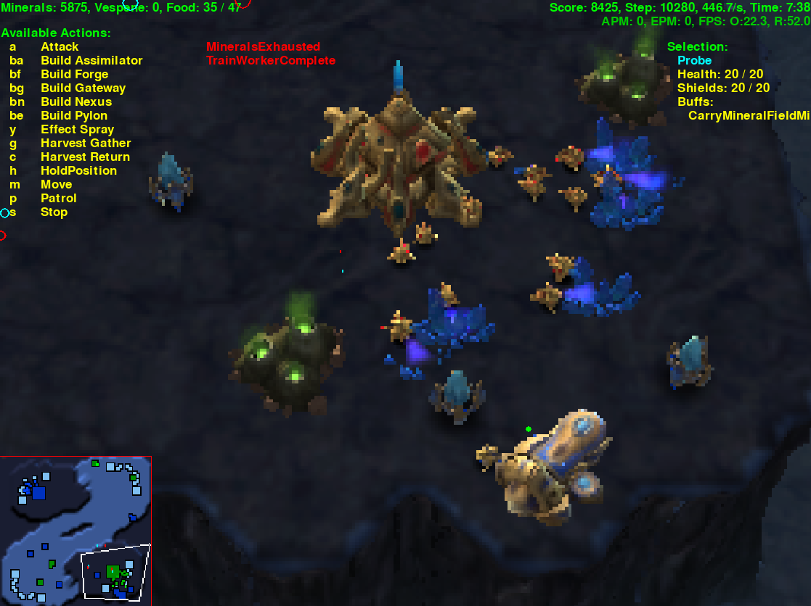

# ProbiusZero

StarCraft II is a rich environment for reinforcement learning. The game offers [large action and state spaces, imperfect information, and delayed credit assignment](https://arxiv.org/abs/1708.04782), all challenges which generalize to a wide class of problems.

This project combines:
* DeepMind's [PySC2 StarCraft II learning environment](https://github.com/deepmind/pysc2)
* DeepMind's [Acme reinforcement learning framework](https://github.com/deepmind/acme)

To attempt to solve simple tasks in StarCraft II. This is in hopes of disproving, even if only a little bit, the following statement:

"Even with a strong self-play system and a diverse league of main and exploiter agents, there would be almost no chance of a system developing successful strategies in such a complex environment without some prior knowledge." [\[1\]](https://deepmind.com/blog/article/AlphaStar-Grandmaster-level-in-StarCraft-II-using-multi-agent-reinforcement-learning)

This project uses the following techniques:

* The [Asynchronous Advantage Actor-Critic (A3C) algorithm](https://arxiv.org/abs/1602.01783) RL algorithm
* The [IMPALA](https://arxiv.org/abs/1802.01561) RL algorithm
* [Auto-regressive policy heads](https://arxiv.org/abs/1903.11524)

To learn the following tasks in StarCraft II:

* Pylon construction
* The best strategy in StarCraft II &mdash; the [cannon rush](https://liquipedia.net/starcraft2/Photon_Cannon_Rush)

<p align='center'>
  
</p>

This project provides the first public implementation of the IMPALA and auto-regressive policy heads on the StarCraft II environment. Further, it is the first application of A3C, IMPALA, and auto-regressive policy heads compatible with the raw action space new to PySC2 v3.0. The environment wrappers currently access a subset of the full StarCraft II action and observation space. The code structure keeps sustainable ways to scale up RL algorithms to the entire space in mind, however. Existing public PySC2 RL frameworks largely focus on minigames (MoveToBeacon, CollectMineralShards, etc.).

## A3C

Adapted for PySC2 from [Morvan Zhou's simple discrete A3C](https://github.com/MorvanZhou/pytorch-A3C). You can find Arthur Juliani's more detailed explanation of A3C [here](https://medium.com/emergent-future/simple-reinforcement-learning-with-tensorflow-part-8-asynchronous-actor-critic-agents-a3c-c88f72a5e9f2).

The main function creates a global network and starts as many workers as there are CPUs. Each worker uses a simple network of four linear feedforward layers. Each worker creates its own PySC2Env, and recommends an action to the smart agent based on its local network. It chooses a random action for the second agent. After every user-defined number of global iterations, all workers update the global network parameters.

The A3C agent attempts to solve the cannon rushing task. It is limited to the actions no operation, build Probe, build pylon, build forge, and build photon cannon. The reward is defined as the change in the resources lost balance between the two agents. A positive reward is returned if the resources lost balance changed in favor of the smart agent in the last step (that is, the agent destroyed more value in units and structures than it lost in the last step). While this reward definition may not lead to higher winrates when compared to a sparse reward of +1 win, -1 loss, it allows for faster initial training.

## AR IMPALA

Auto-regressive heads implemented with guidance from the [AlphaStar <i>Nature</i> paper and supplemental data](https://doi.org/10.1038/s41586-019-1724-z)

The AR IMPALA network takes scalar features (number of probes, number of pylons) and spatial data as observations. These are inputs to a MLP and convolutional network, respectively. The MLP and CNN output is input to an LSTM core. The LSTM core output is input for the action type head, which samples an action, which it feeds to the location head along with an embedding. The location head samples a map point with a deconvolutional network.

<p align='center'>
  
</p>

This implementation currently has action type and location heads. This is a simplified version of the full AlphaStar architecture, which employs delay, queue, selected units, and target unit heads.

The AR IMPALA agent attempts to solve the pylon construction task. It is limited to the actions no operation, build Probe, and build pylon. The reward is defined as the number of pylons constructed at the end of the game. To speed up training, the game steps and step multipiler are shortened such that the agent can only build seven pylons per game.

## Code structure

```
.
├── a3c/
│   ├── actor_critic_model.py     # A3C layers and loss function.
│   ├── manager.py                # Manages workers and global rewards.
│   ├── run.py                    # Set parameters and run training.
│   ├── sc2_env_wrapper.py        # PySC2 to A3C wrapper.
│   ├── utils.py                  # A3C network utilities.
│   └── worker.py                 # Collects local data and pushes to global.
├── ar_impala/
│   ├── actor.py                  # IMPALA actor.
│   ├── agent.py                  # IMPALA actor and learner manager.
│   ├── env_pysc2.py              # Initialize PySC2 environment.
│   ├── env_wrapper.py            # PySC2 to Acme wrapper.
│   ├── heads.py                  # Auto-regressive heads implementation.
│   ├── learner.py                # IMPALA learner.
│   ├── network.py                # IMPALA core, torso, and heads.
│   └── run.py                    # Set parameters and run training.
├── play/
│   ├── replays/                  # Replays.
│   │   └── ...
│   └── ...
├── LICENSE
└── README.md
```

## Play

With minimal training, the A3C agent is able to improve its resources lost balance over the game compared to a random agent. The AR IMPALA agent is able to consistently achieve the maximum score on the pylon construction task.

Moving average episode reward for AR IMPALA, pylon task

<p align='center'>
  
</p>

Moving average episode reward for A3C, cannon task

<p align='center'>
  
</p>

Learning to build Pylons.

<p align='center'>
  
</p>

No shame in building the Forge behind your oppenents' mineral line.

<p align='center'>
  
</p>

It's a contain!

<p align='center'>
  
</p>

Learning to wall off cannons using map features, sharpening the build order, and implementing follow up all-ins can be achieved with more compute resources and time.

View the replays in the `play/` directory yourself.
